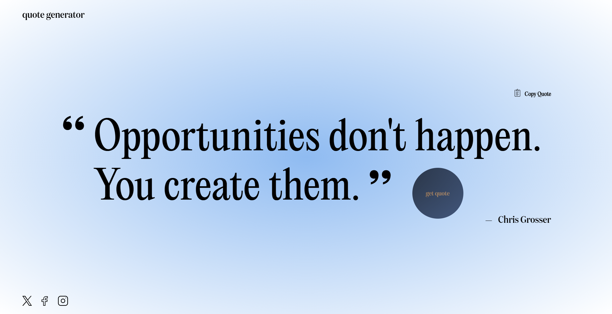

# Random Quote Generator

A sleek, modern web application that generates inspirational quotes with a single click, featuring a custom cursor and elegant typography.



## Features

-   **One-Click Quote Generation**: Get a new inspirational quote with a simple click anywhere on the page
-   **Custom Interactive Cursor**: Engaging cursor animation that enhances user experience
-   **Copy to Clipboard**: Easily copy quotes with a single click
-   **Social Media Sharing**: Direct links to share your favorite quotes on Twitter, Facebook, and Instagram
-   **Responsive Design**: Optimized for all screen sizes from mobile to desktop
-   **Elegant Typography**: Beautiful typography with carefully selected fonts
-   **Smooth Loading Animation**: Spinner animation during quote fetching for a polished user experience

## Technologies Used

-   **HTML5**: Semantic markup for structure
-   **CSS3**: Custom styling with responsive design
-   **JavaScript**: Dynamic content and interactive elements
-   **Tailwind CSS**: Utility-first CSS framework for rapid UI development
-   **Fetch API**: For retrieving quotes from the backend service
-   **Google Fonts**: Typography enhancements

## Usage

1. Simply click anywhere on the page to generate a new quote
2. Use the copy button in the top right to copy the quote to your clipboard
3. Share quotes on social media using the links at the bottom of the page

## Project Structure

```
RandomQuoteGenerator/
├── index.html          # Main HTML file
├── style.css           # Custom styling
├── script.js           # JavaScript functionality
├── tailwind.config.js  # Tailwind configuration
└── img/                # Image assets
    ├── clipboard.png   # Copy to clipboard icon
    ├── copied.png      # Copy confirmation icon
    ├── cursor.png      # Custom cursor image
    ├── quote.svg       # Favicon and logo
    └── Social media icons
```

## Local Development

1. Clone this repository

    ```
    git clone https://github.com/yourusername/RandomQuoteGenerator.git
    ```

2. Open the project folder

    ```
    cd RandomQuoteGenerator
    ```

3. Open `index.html` in your browser or use a local development server

## API

This project uses a custom quote generation API deployed on Railway:
`https://randomquotegeneratorapi.up.railway.app/api/quote`

The API returns quotes in the following format:

```json
{
    "content": "Life is what happens when you're busy making other plans.",
    "author": "John Lennon"
}
```

## Customization

You can customize various aspects of the quote generator:

-   Update the background gradient in `index.html`
-   Modify cursor behaviors in `script.js`
-   Adjust typography and responsive breakpoints in `style.css`

## Future Enhancements

-   Quote categories (motivational, philosophical, etc.)
-   Dark/light theme toggle
-   Save favorite quotes functionality
-   Additional animation effects
-   Multi-language support

## License

This project is licensed under the MIT License - see the LICENSE file for details.

## Acknowledgments

-   Quote API service provided by Railway
-   Icons and design inspiration from various sources
-   Special thanks to all contributors who helped improve this application
